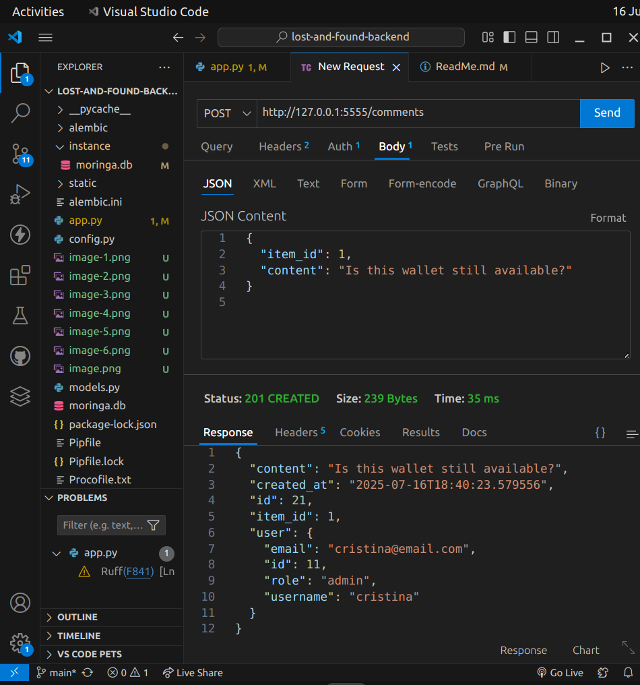

## Authentication Flow

* **Register:** `POST /register`
* **Login:** `POST /login` (returns a JWT token)

Use the returned `token` in requests:

```
Authorization: Bearer <your_jwt_token_here>
```

## Available Routes
Here are the routes defined in your Flask app:

## Moringa Lost and found Backend 


A **Flask REST API** 
for managing users, admins, lost objects

## Setup

1. Clone the repository at:

   ```bash
   https://github.com/Jjumaaa/Moringa-Lost-And-Found-Backend
   Then, cd Moringa-Lost-And-Found-Backend
   ```
2. Install dependencies:

   ```bash
   pipenv install
   pipenv shell
   ```

## Environment Variables

Create a `.env` file:

```bash
FLASK_APP=app.py
FLASK_ENV=development
SECRET_KEY=super-secret-key
DATABASE_URL=sqlite:///moringa.db
```

## Dependencies

Install them with =pipenv "The dependency you want"

* flask
* flask-sqlalchemy
* flask-migrate
* flask-jwt-extended
* psycopg2-binary
* pipenv
* shell
* faker
* alembic
* flask-cors
* sqlalchemy
* serializer
* sqlalchemy-serializer
* flask-bcrypt
* flask-restful

## Database Migrations

```bash
alembic init alembic
alembic revision --autogenerate -m "created all tables"
alembic upgrade head
```

## Seeding the Database

```bash
python seed.py
```

## Run the Server

```bash
python app.py
```

##  Auth Routes

* `POST /register`
  Allows new users (either "user" or "admin") to register by providing username, email, password, and optional role.

* `POST /login`
  Logs in a user using username and password. Returns a JWT token on success.

* `GET /me`
  Returns the currently logged-in user's profile info (requires authentication).

* `PATCH /users/me`
  Updates the logged-in user's profile — supports updating username, email, or password (auth required).

---

##  Admin Routes (Only for role = "admin")

* `GET /users`
  Returns a list of all registered users. Only accessible by admins.

* `DELETE /items/<id>`
  Deletes an item by ID. Admin-only action. Also logs the deletion.

* `POST /claims`
  Admin can initiate a claim on a reported item (e.g., to start ownership verification).

* `PATCH /claims/<id>/approve`
  Admin can approve an existing claim, marking it as resolved.

---

##  Item Routes

* `GET /items`
  Fetches all reported items (lost items by default).

* `POST /items`
  Authenticated users can report a lost item by submitting name, description, location, etc.

* `GET /items/<id>`
  Returns details about a specific item using its ID.

* `PATCH /items/<id>`
  Authenticated users can update item info (e.g., marking it as found).

---

##  Comment Routes

* `POST /comments`
  Authenticated users can post a comment on an item.

* `PATCH /comments/<id>`
  Allows a user or admin to edit a comment.

* `GET /comments`
  Fetches all comments in the system.

* `DELETE /comments/<id>`
  Allows a user (or admin) to delete a comment.

---

##  Reward Routes

* `POST /rewards`
  Authenticated users can offer a cash reward for a lost item.

* `PATCH /rewards/<id>/pay`
  The person offering a reward can mark it as paid, and attach recipient details.

* `GET /rewards/history`
  Authenticated users can see rewards they’ve offered and received.

---

##  Image Routes

* `POST /images`
  Authenticated users can upload image URLs tied to specific items.

* `DELETE /images/<id>`
  Users or admins can delete images they've uploaded (or moderate others’ uploads if admin).

---

##  Root

* `GET /`
 a welcome message directing folks to the README

---

## Render link !!! -- 100% working 
https://moringa-lost-and-found-backend-official.onrender.com

Here is the evidens of the working routes 

## Register user (whether admin or user)

  

## Loggin in whether user or admin
 

## Getting your info 
 
 


## Creating a lost item admin

 

## Getting all lost items (admin)

 


## Upload image for item


## Delete items

 

## Posting a comment
 
 

## Editing a comment


## Deleting a comment
 

## Offer reward


## Mark reward as paid 
 

## Get history of rewards

 

## Claim lost item (admin)

 

##  Approve claims (admin)

 

## Get all users (admin)


 


## Delete items (admin)
 


## Delete items by id 
 


